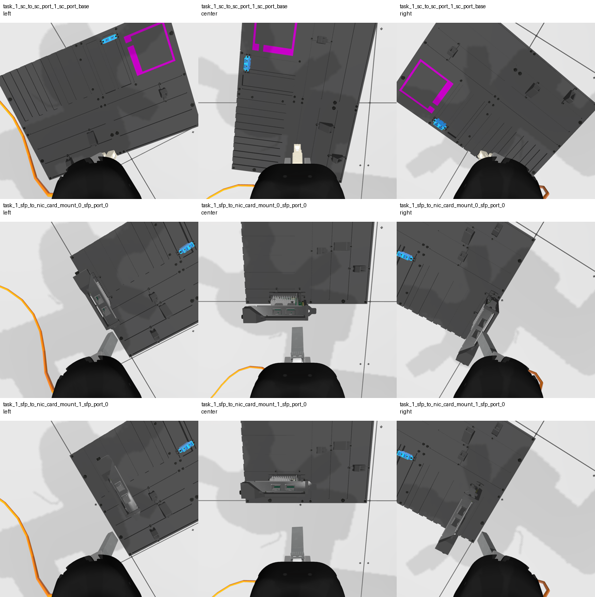
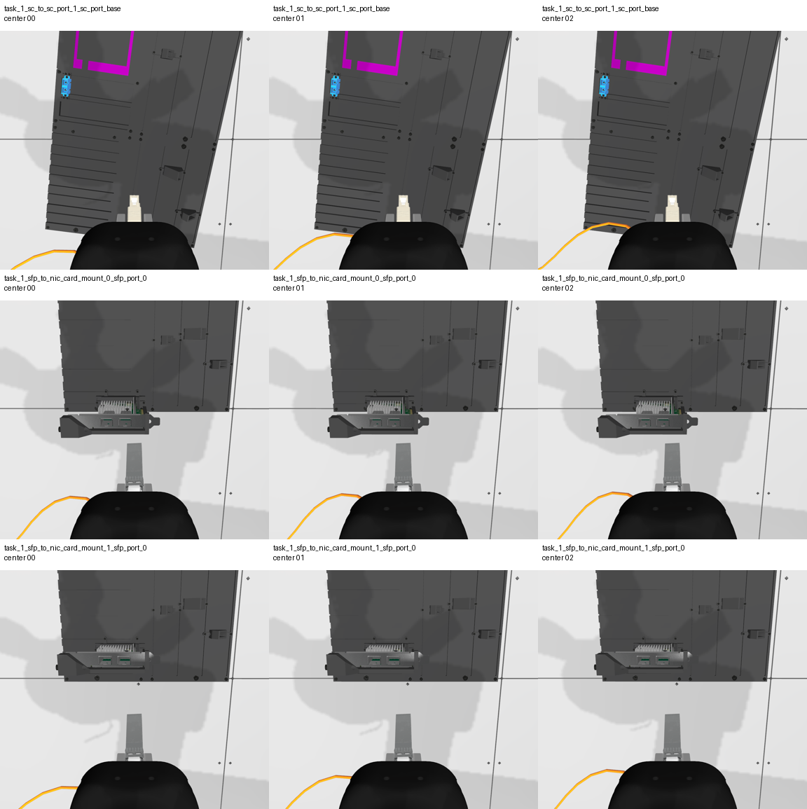

# AIC Competition Work Log

This file is the living project log for our Intrinsic AI for Industry Challenge work. It is meant to preserve context for future agents and for us, so we do not have to re-read the full repository every time.

## Current Status

- We completed a read-only repo reconnaissance pass before implementing anything.
- We identified the safest first implementation step: a compliant policy scaffold that proves lifecycle, task parsing, and observation plumbing.
- We added `aic_model/aic_model/TaskReporter.py`.
- We changed `docker/aic_model/Dockerfile` so the model image defaults to:

```text
policy:=aic_model.TaskReporter
```

- The user ran the scaffold locally with:

```bash
pixi run ros2 run aic_model aic_model --ros-args -p use_sim_time:=true -p policy:=aic_model.TaskReporter
```

- The log confirmed:
  - `TaskReporter` imports and loads.
  - Lifecycle transitions work: configure, activate, deactivate, cleanup, shutdown.
  - The configured-state goal rejection check works. The early `aic_model lifecycle is not in the active state` error is expected.
  - All three tasks were received and parsed.
  - Observations include camera image, joint state, TCP pose, and wrench data.
  - The scaffold returns `True` cleanly for each task.
- The user added the eval terminal log at `/home/optimus/ws_aic/src/terminal_1.log`.
- Review of that eval log confirmed:
  - All 3 trials processed.
  - Successful trials: 3.
  - Failed trials: 0.
  - Total score: 3.000.
  - Tier 1 passed for all trials.
  - Tier 2 was 0 for all trials.
  - Tier 3 was 0 for all trials.
  - No off-limit contacts were detected.
  - No excessive force penalty was applied.
  - No insertion was detected, as expected for a no-motion scaffold.

The current scaffold therefore proves lifecycle/action/observation plumbing but does not attempt the task.

- Added `aic_model/aic_model/PerceptionSnapshot.py` as the next read-only diagnostic policy.
- `PerceptionSnapshot` saves legal camera observations and metadata to disk without moving the robot or using forbidden topics.
- Default output directory is `/tmp/aic_perception_snapshots/<run_timestamp>/`.
- Override with `AIC_SNAPSHOT_DIR=/path/to/output` when launching the model.
- The user ran `PerceptionSnapshot` and saved logs in:
  - `/home/optimus/ws_aic/src/terminal_1.log`
  - `/home/optimus/ws_aic/src/terminal_2.log`
- Review confirmed:
  - `PerceptionSnapshot` loaded successfully.
  - Lifecycle and action behavior passed.
  - 3 snapshots were saved for each of the 3 trials.
  - The saved snapshot run directory is `/home/optimus/ws_aic/snapshots/20260503_005954`.
  - Total score stayed at 3.000, as expected for no-motion diagnostics.
  - No off-limit contact or excessive-force penalty was reported.
- Snapshot image contact sheets were generated for inspection:
  - `/tmp/aic_snapshot_contact.png`
  - `/tmp/aic_snapshot_center_sequence.png`
- The snapshot dataset and generated contact sheets were copied into the repo for durable handoff:
  - `artifacts/perception_snapshot_20260503_005954/`
  - raw snapshot files: 36
  - total artifact size: about 93 MB
- Image inspection confirmed:
  - SC target is visible as a bright cyan/blue port on the task board from all three wrist cameras.
  - SFP/NIC targets are visible in the center camera for both NIC-card trials, with the two greenish SFP port openings distinguishable.
  - Left/right cameras provide useful angled context but center camera is the best initial primary view.
  - The three saved frames per trial are nearly static because the policy sends no motion commands.
- Current recommendation:
  - Build an offline perception-analysis tool over the saved snapshots before commanding robot motion.
  - Start with simple, explainable detectors for SC and SFP target localization, then save annotated outputs for review.
  - Keep using only legal `Observation` data and task fields.

## Important Competition Rules

Highest-priority rule: submitted policy must use only official interfaces.

Forbidden during evaluation:

- Directly manipulating robot/task-board/simulation state.
- Communicating with simulator/scoring/backend internals.
- Using `/scoring`, `/gazebo`, `/gz_server`, `/aic_engine`, `/ros_gz_bridge`, or similar backend namespaces.
- Spawning/deleting entities.
- Reading simulator world/model state, `/clock`, `/model`, `/world_stats`, physics pause/reset, or internal Gazebo state.
- Hardcoding trial-specific simulator state to exploit the public sample config.
- Depending on ground-truth object poses during evaluation.

Allowed/expected interfaces:

- Sensor inputs through official ROS topics and the `Observation` message.
- `/insert_cable` action.
- `/aic_controller/pose_commands`.
- `/aic_controller/joint_commands`.
- `/aic_controller/change_target_mode`.
- Standard lifecycle behavior for node `aic_model`.

Ground truth may be used for training/debugging, but not as an evaluation dependency.

## Repository Overview

Repo root:

```text
/home/optimus/ws_aic/src/aic
```

Main packages:

- `aic_model/`
  - Participant-facing Python lifecycle node wrapper.
  - Entry point: `aic_model/aic_model/aic_model.py`.
  - Base policy API: `aic_model/aic_model/policy.py`.
  - Our scaffold: `aic_model/aic_model/TaskReporter.py`.
  - Recommended place for simple policy work if we keep everything inside existing package.

- `aic_example_policies/`
  - Reference policies.
  - `WaveArm`: minimal dummy movement.
  - `CheatCode`: ground-truth policy for debugging only; not compliant for final eval.
  - `RunACT`: example learned policy integration.

- `aic_engine/`
  - Trial orchestrator.
  - Validates lifecycle behavior.
  - Spawns task board and cable.
  - Sends `/insert_cable` goals.
  - Starts/stops scoring recordings.
  - Writes scoring output to `$AIC_RESULTS_DIR/scoring.yaml` or `~/aic_results/scoring.yaml`.

- `aic_adapter/`
  - Synchronizes sensor streams into `aic_model_interfaces/msg/Observation`.
  - Observation includes:
    - left/center/right RGB camera image and camera info
    - wrist wrench
    - joint states
    - controller state

- `aic_controller/`
  - Low-level impedance controller.
  - Accepts Cartesian commands via `/aic_controller/pose_commands`.
  - Accepts joint commands via `/aic_controller/joint_commands`.
  - Mode is selected through `/aic_controller/change_target_mode`.

- `aic_scoring/`
  - Implements scoring.
  - Tier 1: model validity.
  - Tier 2: jerk, duration, path efficiency, force penalty, off-limit contact penalty.
  - Tier 3: insertion success, partial insertion, proximity.

- `aic_interfaces/`
  - ROS message/action/service definitions.
  - Important files:
    - `aic_task_interfaces/action/InsertCable.action`
    - `aic_task_interfaces/msg/Task.msg`
    - `aic_model_interfaces/msg/Observation.msg`
    - `aic_control_interfaces/msg/MotionUpdate.msg`
    - `aic_control_interfaces/msg/JointMotionUpdate.msg`

- `aic_bringup/`
  - Launch files and sim config.
  - Main launch: `aic_bringup/launch/aic_gz_bringup.launch.py`.

- `aic_assets/`
  - Gazebo models/assets for cables, SFP, SC, NIC cards, task board, cameras, gripper, etc.

- `docker/`
  - `docker/aic_model/Dockerfile`: participant model image.
  - `docker/aic_eval/Dockerfile`: evaluation image.
  - `docker/docker-compose.yaml`: local two-container eval/model setup.

## Task Understanding

Qualification phase:

- Single cable insertion per trial.
- Same submitted policy is used for all trials.
- Evaluation occurs in Gazebo.
- Robot starts holding one plug.
- Plug starts close to the target.
- Board pose and components are randomized.
- Exact final trial sequence may change, but tasks are combinations of SFP and SC insertion.

Trial types:

- SFP trials:
  - Robot holds `SFP_MODULE`.
  - Insert into `SFP_PORT_0` or `SFP_PORT_1` on a target NIC card.
  - There may be multiple NIC cards and therefore multiple SFP ports.
  - Target is specified by `Task.target_module_name` and `Task.port_name`.

- SC trials:
  - Robot holds `SC_PLUG`.
  - Insert into target SC port.
  - One or both SC ports may be present.
  - Target is specified by `Task.target_module_name` and `Task.port_name`.

Observed local sample tasks from scaffold run:

```text
trial 1: cable_0, plug=sfp_tip, target=nic_card_mount_0/sfp_port_0
trial 2: cable_0, plug=sfp_tip, target=nic_card_mount_1/sfp_port_0
trial 3: cable_1, plug=sc_tip, target=sc_port_1/sc_port_base
```

## Scoring Notes

Current scoring source and `docs/scoring.md` agree on:

- Max per trial: 100.
- Max qualification total: 300 over 3 trials.
- Tier 1:
  - 1 point for valid lifecycle/action behavior.
- Tier 2:
  - smoothness: 0 to 6
  - duration: 0 to 12
  - efficiency: 0 to 6
  - force penalty: 0 to -12
  - off-limit contact penalty: 0 to -24
- Tier 3:
  - correct insertion: 75
  - wrong-port insertion: -12
  - partial insertion: 38 to 50
  - proximity: 0 to 25

Important scoring behavior:

- Tier 2 positive bonuses are only awarded if Tier 3 score is greater than 0.
- Task duration ends when the action result returns.
- Returning `True` without moving is fine for scaffold validation, but will not score insertion.
- Full insertion dominates scoring; optimize reliability before speed.

Known documentation discrepancy:

- `docs/scoring_tests.md` appears to mention older score values, such as Tier 3 max 60.
- Trust `docs/scoring.md` plus `aic_scoring/src/ScoringTier2.cc` unless later official docs say otherwise.

## Decisions Made

### Decision: Use existing `aic_model` wrapper

Why:

- It already satisfies most lifecycle/action boilerplate.
- It rejects goals when inactive/configured.
- It handles command publishing through lifecycle publishers.
- It reduces compliance risk compared with writing a custom lifecycle node.

### Decision: First implementation is read-only `TaskReporter`

Why:

- Tier 1/lifecycle compliance is a gate.
- We need to prove the task message and observations are available before perception/control.
- It avoids premature movement, force penalties, and simulator contact risk.

### Decision: Avoid `CheatCode` for default Docker policy

Why:

- `CheatCode` depends on ground-truth TF and is not a compliant evaluation policy.
- It is useful only for training/debugging.

### Decision: Next technical focus should be perception/localization

Why:

- Multiple SFP/SC ports may be present.
- Hidden evaluation randomizes board and component placement.
- We need target localization from allowed observations before insertion control.

### Decision: Add `PerceptionSnapshot` before motion

Why:

- We need to inspect what each wrist camera sees for SFP and SC trials.
- Saved frames plus camera intrinsics let us evaluate whether classical vision is enough.
- It stays compliant because it only consumes `Observation` data and writes local diagnostic artifacts.
- It exits like `TaskReporter` and sends no robot commands.

## Commands To Run

Use these from repo root:

```bash
cd /home/optimus/ws_aic/src/aic
```

### Refresh local Pixi package after source edits

Pixi does not automatically see changes in local packages.

```bash
pixi reinstall ros-kilted-aic-model
```

If this fails due cache permissions, fix Pixi/cache permissions or run with appropriate local user setup. Avoid changing code just to work around package installation unless necessary.

### Run evaluation environment

Terminal 1:

```bash
export DBX_CONTAINER_MANAGER=docker
distrobox enter -r aic_eval -- /entrypoint.sh ground_truth:=false start_aic_engine:=true
```

Wait for engine logs saying it is looking for `aic_model`.

### Run scaffold policy

Terminal 2:

```bash
pixi run ros2 run aic_model aic_model --ros-args -p use_sim_time:=true -p policy:=aic_model.TaskReporter
```

Expected model logs:

- `Loading policy module: aic_model.TaskReporter`
- `Using policy: TaskReporter`
- `on_configure`
- `TaskReporter.__init__()`
- early inactive-state rejection error during engine test
- `on_activate`
- `Goal accepted`
- `TaskReporter.insert_cable() enter`
- `Task received: ...`
- `Observation received: center_image=1152x1024 ...`
- `TaskReporter observed task and sensor inputs successfully.`
- `insert_cable() returned True`
- repeats for all trials
- `on_cleanup`
- `on_shutdown`

Expected scoring:

- Tier 1 should pass.
- Tier 3 should be 0 or near 0 because no insertion is attempted.
- Total score should be low. That is expected at this stage.

Observed scaffold scoring from `/home/optimus/ws_aic/src/terminal_1.log`:

```text
total: 3
trial_1: tier_1=1, tier_2=0, tier_3=0, final plug-port distance=0.13m
trial_2: tier_1=1, tier_2=0, tier_3=0, final plug-port distance=0.14m
trial_3: tier_1=1, tier_2=0, tier_3=0, final plug-port distance=0.32m
```

This is the expected result for `TaskReporter`.

### Run perception snapshot policy

After editing or adding local Python policy files, refresh the Pixi package:

```bash
pixi reinstall ros-kilted-aic-model
```

Terminal 1, eval:

```bash
export DBX_CONTAINER_MANAGER=docker
distrobox enter -r aic_eval -- /entrypoint.sh ground_truth:=false start_aic_engine:=true
```

Terminal 2, policy:

```bash
mkdir -p /home/optimus/ws_aic/snapshots
AIC_SNAPSHOT_DIR=/home/optimus/ws_aic/snapshots \
pixi run ros2 run aic_model aic_model --ros-args -p use_sim_time:=true -p policy:=aic_model.PerceptionSnapshot
```

Expected model logs:

- `Loading policy module: aic_model.PerceptionSnapshot`
- `Using policy: PerceptionSnapshot`
- `Saving perception snapshots to ...`
- `PerceptionSnapshot task: ... target=...`
- `Saved perception snapshot 1 ...`
- `Saved perception snapshot 2 ...`
- `Saved perception snapshot 3 ...`
- `PerceptionSnapshot complete.`

Expected output files:

```text
/home/optimus/ws_aic/snapshots/<run_timestamp>/
  task_1_sfp_to_nic_card_mount_0_sfp_port_0/
    00_left.ppm
    00_center.ppm
    00_right.ppm
    00_metadata.json
    ...
  task_1_sfp_to_nic_card_mount_1_sfp_port_0/
    ...
  task_1_sc_to_sc_port_1_sc_port_base/
    ...
```

The `.ppm` files can be opened by most image viewers. Metadata includes task fields, camera intrinsics, joint state, TCP pose, TCP velocity, and wrist wrench.

Observed `PerceptionSnapshot` output from the 2026-05-03 run:

```text
/home/optimus/ws_aic/snapshots/20260503_005954/
  task_1_sfp_to_nic_card_mount_0_sfp_port_0/
  task_1_sfp_to_nic_card_mount_1_sfp_port_0/
  task_1_sc_to_sc_port_1_sc_port_base/
```

Each task directory contains:

```text
00_left.ppm
00_center.ppm
00_right.ppm
00_metadata.json
01_left.ppm
01_center.ppm
01_right.ppm
01_metadata.json
02_left.ppm
02_center.ppm
02_right.ppm
02_metadata.json
```

Total files: 36.

Observed eval summary:

```text
Successful: 3
Failed: 0
Total Score: 3.000
trial_1: tier_1=1, tier_2=0, tier_3=0, final plug-port distance=0.13m
trial_2: tier_1=1, tier_2=0, tier_3=0, final plug-port distance=0.14m
trial_3: tier_1=1, tier_2=0, tier_3=0, final plug-port distance=0.32m
```

## Current Issues And Watch Items

### Pixi reinstall needed after source changes

Symptom:

```text
ModuleNotFoundError: No module named 'aic_model.TaskReporter'
```

Cause:

- The source file exists, but Pixi is using the installed copy under `.pixi/envs/default`.

Fix:

```bash
pixi reinstall ros-kilted-aic-model
```

### Wrench z value around 20N in scaffold logs

Observation:

- Scaffold showed wrist force z around 20.5N while no motion commands were sent.

Interpretation:

- Likely attached cable/tool/load/tare behavior, not policy-induced insertion force.

Follow-up:

- Watch force carefully once we begin motion.
- Use compliant, low-stiffness/slow final insertion to avoid sustained force penalty.

### Need terminal 1 scoring confirmation

Resolved. Eval terminal log was added at `/home/optimus/ws_aic/src/terminal_1.log` and reviewed.

- Model validation/Tier 1 passed in all 3 trials.
- Trial processing completed cleanly.
- No insertion was detected, which is expected.
- Total score was 3.000.

### Shutdown noise after Ctrl-C

After the engine completed cleanly, the user interrupted the eval environment with Ctrl-C. The log then showed Gazebo/container shutdown errors such as:

```text
double free or corruption (!prev)
process failed to terminate ... escalating to SIGTERM/SIGKILL
```

Interpretation:

- These happened after `All Trials Processed` and after `aic_engine` finished cleanly.
- Treat them as Gazebo/eval shutdown noise, not a policy failure.

The same pattern occurred after the `PerceptionSnapshot` run.

Terminal 2 also showed a `tf2_ros` listener thread `ExternalShutdownException` after Ctrl-C. This occurred after `on_shutdown` and after the run had completed; treat it as shutdown noise, not a policy failure.

### ACL watch item

The eval log contains Zenoh access-control messages like:

```text
did not match any configured ACL subject. Default permission `Allow` will be applied
```

Interpretation:

- The scaffold itself did not touch forbidden interfaces, so this is not currently a policy concern.
- Before final confidence, run a stricter ACL-enabled local check so we know the policy works under portal-like model access controls.

### Context compression watch item

This `log.md` file is intended to preserve the important project state across context compression or future agent handoff.

Important details that should survive through this file:

- Competition compliance rules and forbidden interfaces.
- Repo package map and key entry points.
- Files changed so far.
- Commands that worked locally.
- Observed task sequence and scoring results.
- Snapshot directory and image-evaluation findings.
- Current recommendation: offline perception analysis before motion.

After any context compression, a future agent should read this file first before touching code.

## Perception Snapshot Image Evaluation

Source snapshot run:

```text
/home/optimus/ws_aic/snapshots/20260503_005954
```

Copied repo artifact:

```text
artifacts/perception_snapshot_20260503_005954
```

Derived contact sheets used for visual inspection:

```text
/tmp/aic_snapshot_contact.png
/tmp/aic_snapshot_center_sequence.png
```

Repo-local contact sheets:

```text
artifacts/perception_snapshot_20260503_005954/contact_sheets/aic_snapshot_contact.png
artifacts/perception_snapshot_20260503_005954/contact_sheets/aic_snapshot_center_sequence.png
```

All-camera contact sheet:



Center-camera sequence contact sheet:



SC trial:

- Directory: `task_1_sc_to_sc_port_1_sc_port_base`
- Target from task message: `target_module_name=sc_port_1`, `port_name=sc_port_base`.
- The cyan/blue SC port is clearly visible in the left, center, and right images.
- The magenta square/outline is also visible, but it appears to be board marking/fixture context rather than the requested port.
- The center camera sees the target in the upper-left/left region of the image, with the plug/gripper visible near the bottom.

SFP trial 1:

- Directory: `task_1_sfp_to_nic_card_mount_0_sfp_port_0`
- Target from task message: `target_module_name=nic_card_mount_0`, `port_name=sfp_port_0`.
- The target NIC assembly is visible near the lower center of the center camera.
- Two greenish rectangular SFP port openings are visible on the NIC module.
- The left/right cameras see the module from oblique angles and may help resolve orientation.

SFP trial 2:

- Directory: `task_1_sfp_to_nic_card_mount_1_sfp_port_0`
- Target from task message: `target_module_name=nic_card_mount_1`, `port_name=sfp_port_0`.
- Similar to trial 1: the NIC assembly and greenish SFP ports are visible in the center image.
- The board/component position differs from trial 1, confirming we need task-conditioned localization rather than a single hardcoded pixel location.

Implications:

- A legal vision-based localization path is plausible because the target hardware is visible before motion.
- Center camera should be the first detector input; left/right can be added for cross-checks or stereo-style geometry later.
- Start with offline image processing:
  - SC: segment bright cyan/blue high-saturation target region and estimate a port center/orientation.
  - SFP: detect the NIC/card assembly and green port rectangles, then choose `sfp_port_0` or `sfp_port_1` by task name and observed ordering.
- Avoid using ground-truth TF or scoring topics in the runtime policy.

## Next Implementation Plan

1. Keep `TaskReporter` and `PerceptionSnapshot` as diagnostic policies.
2. Build an offline perception-analysis script/tool for saved snapshots:
   - load `.ppm` images and metadata
   - run initial SC and SFP heuristic detectors
   - save annotated PNGs with detected boxes/keypoints
   - report confidence and selected target center/orientation
3. Review detector outputs on the current three trials.
4. If detector quality is acceptable, integrate the detector into a diagnostic runtime policy that logs detections but still sends no motion.
5. Add guarded motion in stages:
   - move to a visually estimated pre-insertion pose
   - align yaw/roll/pitch
   - slow compliant approach
   - monitor wrench and controller state
   - return action result after insertion/stabilization
6. Test SFP and SC separately.
7. Only after reliable insertion, optimize speed/path/smoothness.

## Files Changed So Far

- `aic_model/aic_model/TaskReporter.py`
  - New read-only scaffold policy.

- `aic_model/aic_model/PerceptionSnapshot.py`
  - New read-only policy for saving camera frames and observation metadata.

- `docker/aic_model/Dockerfile`
  - Changed default policy from `aic_example_policies.ros.CheatCode` to `aic_model.TaskReporter`.

- `artifacts/perception_snapshot_20260503_005954/`
  - Copied raw snapshot data and contact-sheet PNGs into the repo for durable visual/context handoff.
