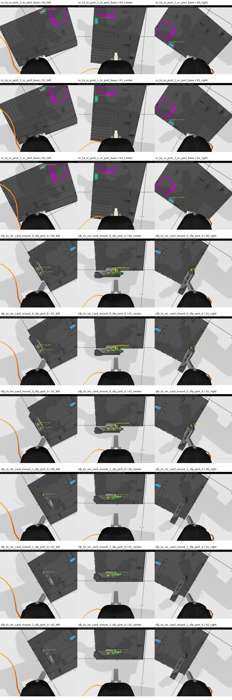
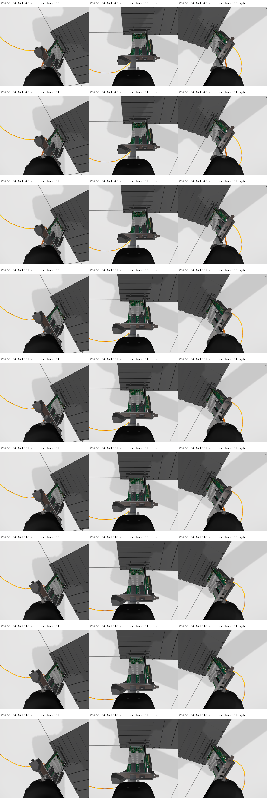
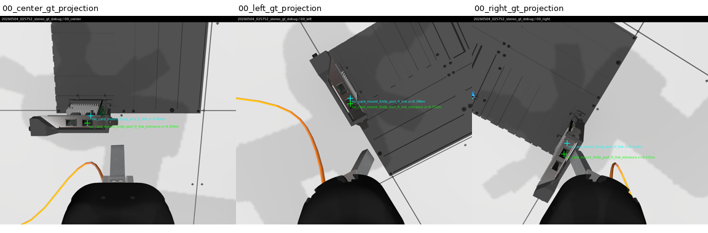
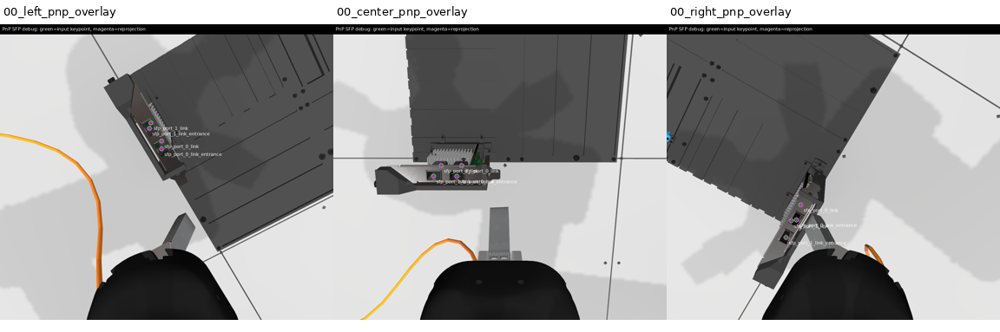
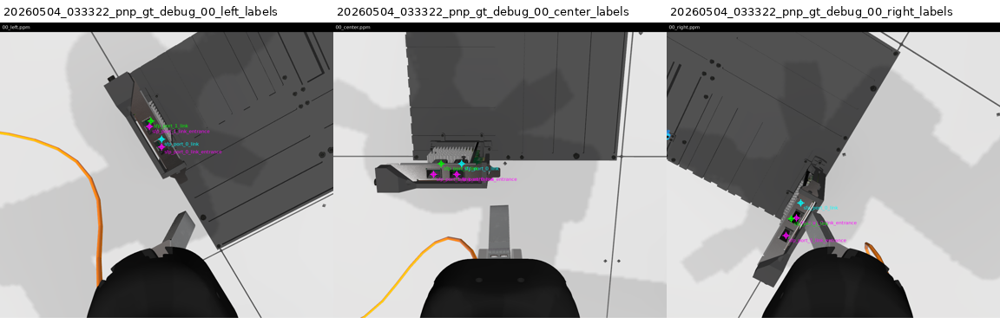

# AIC Competition Work Log

This file is the living project log for our Intrinsic AI for Industry Challenge work. It is meant to preserve context for future agents and for us, so we do not have to re-read the full repository every time.

## Current Status

- We completed a read-only repo reconnaissance pass before implementing anything.
- We identified the safest first implementation step: a compliant policy scaffold that proves lifecycle, task parsing, and observation plumbing.
- We added `aic_model/aic_model/TaskReporter.py`.
- We changed `docker/aic_model/Dockerfile` so the model image defaults to:

```text
policy:=aic_model.TaskReporter
```

- The user ran the scaffold locally with:

```bash
pixi run ros2 run aic_model aic_model --ros-args -p use_sim_time:=true -p policy:=aic_model.TaskReporter
```

- The log confirmed:
  - `TaskReporter` imports and loads.
  - Lifecycle transitions work: configure, activate, deactivate, cleanup, shutdown.
  - The configured-state goal rejection check works. The early `aic_model lifecycle is not in the active state` error is expected.
  - All three tasks were received and parsed.
  - Observations include camera image, joint state, TCP pose, and wrench data.
  - The scaffold returns `True` cleanly for each task.
- The user added the eval terminal log at `/home/optimus/ws_aic/src/terminal_1.log`.
- Review of that eval log confirmed:
  - All 3 trials processed.
  - Successful trials: 3.
  - Failed trials: 0.
  - Total score: 3.000.
  - Tier 1 passed for all trials.
  - Tier 2 was 0 for all trials.
  - Tier 3 was 0 for all trials.
  - No off-limit contacts were detected.
  - No excessive force penalty was applied.
  - No insertion was detected, as expected for a no-motion scaffold.

The current scaffold therefore proves lifecycle/action/observation plumbing but does not attempt the task.

- Added `aic_model/aic_model/PerceptionSnapshot.py` as the next read-only diagnostic policy.
- `PerceptionSnapshot` saves legal camera observations and metadata to disk without moving the robot or using forbidden topics.
- Default output directory is `/tmp/aic_perception_snapshots/<run_timestamp>/`.
- Override with `AIC_SNAPSHOT_DIR=/path/to/output` when launching the model.
- The user ran `PerceptionSnapshot` and saved logs in:
  - `/home/optimus/ws_aic/src/terminal_1.log`
  - `/home/optimus/ws_aic/src/terminal_2.log`
- Review confirmed:
  - `PerceptionSnapshot` loaded successfully.
  - Lifecycle and action behavior passed.
  - 3 snapshots were saved for each of the 3 trials.
  - The saved snapshot run directory is `/home/optimus/ws_aic/snapshots/20260503_005954`.
  - Total score stayed at 3.000, as expected for no-motion diagnostics.
  - No off-limit contact or excessive-force penalty was reported.
- Snapshot image contact sheets were generated for inspection:
  - `/tmp/aic_snapshot_contact.png`
  - `/tmp/aic_snapshot_center_sequence.png`
- The snapshot dataset and generated contact sheets were copied into the repo for durable handoff:
  - `artifacts/perception_snapshot_20260503_005954/`
  - raw snapshot files: 36
  - total artifact size: about 93 MB
- Image inspection confirmed:
  - SC target is visible as a bright cyan/blue port on the task board from all three wrist cameras.
  - SFP/NIC targets are visible in the center camera for both NIC-card trials, with the two greenish SFP port openings distinguishable.
  - Left/right cameras provide useful angled context but center camera is the best initial primary view.
  - The three saved frames per trial are nearly static because the policy sends no motion commands.
- Current recommendation:
  - Build an offline perception-analysis tool over the saved snapshots before commanding robot motion.
  - Start with simple, explainable detectors for SC and SFP target localization, then save annotated outputs for review.
  - Keep using only legal `Observation` data and task fields.

## Important Competition Rules

Highest-priority rule: submitted policy must use only official interfaces.

Forbidden during evaluation:

- Directly manipulating robot/task-board/simulation state.
- Communicating with simulator/scoring/backend internals.
- Using `/scoring`, `/gazebo`, `/gz_server`, `/aic_engine`, `/ros_gz_bridge`, or similar backend namespaces.
- Spawning/deleting entities.
- Reading simulator world/model state, `/clock`, `/model`, `/world_stats`, physics pause/reset, or internal Gazebo state.
- Hardcoding trial-specific simulator state to exploit the public sample config.
- Depending on ground-truth object poses during evaluation.

Allowed/expected interfaces:

- Sensor inputs through official ROS topics and the `Observation` message.
- `/insert_cable` action.
- `/aic_controller/pose_commands`.
- `/aic_controller/joint_commands`.
- `/aic_controller/change_target_mode`.
- Standard lifecycle behavior for node `aic_model`.

Ground truth may be used for training/debugging, but not as an evaluation dependency.

## Repository Overview

Repo root:

```text
/home/optimus/ws_aic/src/aic
```

Main packages:

- `aic_model/`
  - Participant-facing Python lifecycle node wrapper.
  - Entry point: `aic_model/aic_model/aic_model.py`.
  - Base policy API: `aic_model/aic_model/policy.py`.
  - Our scaffold: `aic_model/aic_model/TaskReporter.py`.
  - Recommended place for simple policy work if we keep everything inside existing package.

- `aic_example_policies/`
  - Reference policies.
  - `WaveArm`: minimal dummy movement.
  - `CheatCode`: ground-truth policy for debugging only; not compliant for final eval.
  - `RunACT`: example learned policy integration.

- `aic_engine/`
  - Trial orchestrator.
  - Validates lifecycle behavior.
  - Spawns task board and cable.
  - Sends `/insert_cable` goals.
  - Starts/stops scoring recordings.
  - Writes scoring output to `$AIC_RESULTS_DIR/scoring.yaml` or `~/aic_results/scoring.yaml`.

- `aic_adapter/`
  - Synchronizes sensor streams into `aic_model_interfaces/msg/Observation`.
  - Observation includes:
    - left/center/right RGB camera image and camera info
    - wrist wrench
    - joint states
    - controller state

- `aic_controller/`
  - Low-level impedance controller.
  - Accepts Cartesian commands via `/aic_controller/pose_commands`.
  - Accepts joint commands via `/aic_controller/joint_commands`.
  - Mode is selected through `/aic_controller/change_target_mode`.

- `aic_scoring/`
  - Implements scoring.
  - Tier 1: model validity.
  - Tier 2: jerk, duration, path efficiency, force penalty, off-limit contact penalty.
  - Tier 3: insertion success, partial insertion, proximity.

- `aic_interfaces/`
  - ROS message/action/service definitions.
  - Important files:
    - `aic_task_interfaces/action/InsertCable.action`
    - `aic_task_interfaces/msg/Task.msg`
    - `aic_model_interfaces/msg/Observation.msg`
    - `aic_control_interfaces/msg/MotionUpdate.msg`
    - `aic_control_interfaces/msg/JointMotionUpdate.msg`

- `aic_bringup/`
  - Launch files and sim config.
  - Main launch: `aic_bringup/launch/aic_gz_bringup.launch.py`.

- `aic_assets/`
  - Gazebo models/assets for cables, SFP, SC, NIC cards, task board, cameras, gripper, etc.

- `docker/`
  - `docker/aic_model/Dockerfile`: participant model image.
  - `docker/aic_eval/Dockerfile`: evaluation image.
  - `docker/docker-compose.yaml`: local two-container eval/model setup.

## Task Understanding

Qualification phase:

- Single cable insertion per trial.
- Same submitted policy is used for all trials.
- Evaluation occurs in Gazebo.
- Robot starts holding one plug.
- Plug starts close to the target.
- Board pose and components are randomized.
- Exact final trial sequence may change, but tasks are combinations of SFP and SC insertion.

Trial types:

- SFP trials:
  - Robot holds `SFP_MODULE`.
  - Insert into `SFP_PORT_0` or `SFP_PORT_1` on a target NIC card.
  - There may be multiple NIC cards and therefore multiple SFP ports.
  - Target is specified by `Task.target_module_name` and `Task.port_name`.

- SC trials:
  - Robot holds `SC_PLUG`.
  - Insert into target SC port.
  - One or both SC ports may be present.
  - Target is specified by `Task.target_module_name` and `Task.port_name`.

Observed local sample tasks from scaffold run:

```text
trial 1: cable_0, plug=sfp_tip, target=nic_card_mount_0/sfp_port_0
trial 2: cable_0, plug=sfp_tip, target=nic_card_mount_1/sfp_port_0
trial 3: cable_1, plug=sc_tip, target=sc_port_1/sc_port_base
```

## Scoring Notes

Current scoring source and `docs/scoring.md` agree on:

- Max per trial: 100.
- Max qualification total: 300 over 3 trials.
- Tier 1:
  - 1 point for valid lifecycle/action behavior.
- Tier 2:
  - smoothness: 0 to 6
  - duration: 0 to 12
  - efficiency: 0 to 6
  - force penalty: 0 to -12
  - off-limit contact penalty: 0 to -24
- Tier 3:
  - correct insertion: 75
  - wrong-port insertion: -12
  - partial insertion: 38 to 50
  - proximity: 0 to 25

Important scoring behavior:

- Tier 2 positive bonuses are only awarded if Tier 3 score is greater than 0.
- Task duration ends when the action result returns.
- Returning `True` without moving is fine for scaffold validation, but will not score insertion.
- Full insertion dominates scoring; optimize reliability before speed.

Known documentation discrepancy:

- `docs/scoring_tests.md` appears to mention older score values, such as Tier 3 max 60.
- Trust `docs/scoring.md` plus `aic_scoring/src/ScoringTier2.cc` unless later official docs say otherwise.

## Decisions Made

### Decision: Use existing `aic_model` wrapper

Why:

- It already satisfies most lifecycle/action boilerplate.
- It rejects goals when inactive/configured.
- It handles command publishing through lifecycle publishers.
- It reduces compliance risk compared with writing a custom lifecycle node.

### Decision: First implementation is read-only `TaskReporter`

Why:

- Tier 1/lifecycle compliance is a gate.
- We need to prove the task message and observations are available before perception/control.
- It avoids premature movement, force penalties, and simulator contact risk.

### Decision: Avoid `CheatCode` for default Docker policy

Why:

- `CheatCode` depends on ground-truth TF and is not a compliant evaluation policy.
- It is useful only for training/debugging.

### Decision: Next technical focus should be perception/localization

Why:

- Multiple SFP/SC ports may be present.
- Hidden evaluation randomizes board and component placement.
- We need target localization from allowed observations before insertion control.

### Decision: Add `PerceptionSnapshot` before motion

Why:

- We need to inspect what each wrist camera sees for SFP and SC trials.
- Saved frames plus camera intrinsics let us evaluate whether classical vision is enough.
- It stays compliant because it only consumes `Observation` data and writes local diagnostic artifacts.
- It exits like `TaskReporter` and sends no robot commands.

## Commands To Run

Use these from repo root:

```bash
cd /home/optimus/ws_aic/src/aic
```

### Refresh local Pixi package after source edits

Pixi does not automatically see changes in local packages.

```bash
pixi reinstall ros-kilted-aic-model
```

If this fails due cache permissions, fix Pixi/cache permissions or run with appropriate local user setup. Avoid changing code just to work around package installation unless necessary.

### Run evaluation environment

Terminal 1:

```bash
export DBX_CONTAINER_MANAGER=docker
distrobox enter -r aic_eval -- /entrypoint.sh ground_truth:=false start_aic_engine:=true
```

Wait for engine logs saying it is looking for `aic_model`.

### Run scaffold policy

Terminal 2:

```bash
pixi run ros2 run aic_model aic_model --ros-args -p use_sim_time:=true -p policy:=aic_model.TaskReporter
```

Expected model logs:

- `Loading policy module: aic_model.TaskReporter`
- `Using policy: TaskReporter`
- `on_configure`
- `TaskReporter.__init__()`
- early inactive-state rejection error during engine test
- `on_activate`
- `Goal accepted`
- `TaskReporter.insert_cable() enter`
- `Task received: ...`
- `Observation received: center_image=1152x1024 ...`
- `TaskReporter observed task and sensor inputs successfully.`
- `insert_cable() returned True`
- repeats for all trials
- `on_cleanup`
- `on_shutdown`

Expected scoring:

- Tier 1 should pass.
- Tier 3 should be 0 or near 0 because no insertion is attempted.
- Total score should be low. That is expected at this stage.

Observed scaffold scoring from `/home/optimus/ws_aic/src/terminal_1.log`:

```text
total: 3
trial_1: tier_1=1, tier_2=0, tier_3=0, final plug-port distance=0.13m
trial_2: tier_1=1, tier_2=0, tier_3=0, final plug-port distance=0.14m
trial_3: tier_1=1, tier_2=0, tier_3=0, final plug-port distance=0.32m
```

This is the expected result for `TaskReporter`.

### Run perception snapshot policy

After editing or adding local Python policy files, refresh the Pixi package:

```bash
pixi reinstall ros-kilted-aic-model
```

Terminal 1, eval:

```bash
export DBX_CONTAINER_MANAGER=docker
distrobox enter -r aic_eval -- /entrypoint.sh ground_truth:=false start_aic_engine:=true
```

Terminal 2, policy:

```bash
mkdir -p /home/optimus/ws_aic/snapshots
AIC_SNAPSHOT_DIR=/home/optimus/ws_aic/snapshots \
pixi run ros2 run aic_model aic_model --ros-args -p use_sim_time:=true -p policy:=aic_model.PerceptionSnapshot
```

Expected model logs:

- `Loading policy module: aic_model.PerceptionSnapshot`
- `Using policy: PerceptionSnapshot`
- `Saving perception snapshots to ...`
- `PerceptionSnapshot task: ... target=...`
- `Saved perception snapshot 1 ...`
- `Saved perception snapshot 2 ...`
- `Saved perception snapshot 3 ...`
- `PerceptionSnapshot complete.`

Expected output files:

```text
/home/optimus/ws_aic/snapshots/<run_timestamp>/
  task_1_sfp_to_nic_card_mount_0_sfp_port_0/
    00_left.ppm
    00_center.ppm
    00_right.ppm
    00_metadata.json
    ...
  task_1_sfp_to_nic_card_mount_1_sfp_port_0/
    ...
  task_1_sc_to_sc_port_1_sc_port_base/
    ...
```

The `.ppm` files can be opened by most image viewers. Metadata includes task fields, camera intrinsics, joint state, TCP pose, TCP velocity, and wrist wrench.

Observed `PerceptionSnapshot` output from the 2026-05-03 run:

```text
/home/optimus/ws_aic/snapshots/20260503_005954/
  task_1_sfp_to_nic_card_mount_0_sfp_port_0/
  task_1_sfp_to_nic_card_mount_1_sfp_port_0/
  task_1_sc_to_sc_port_1_sc_port_base/
```

Each task directory contains:

```text
00_left.ppm
00_center.ppm
00_right.ppm
00_metadata.json
01_left.ppm
01_center.ppm
01_right.ppm
01_metadata.json
02_left.ppm
02_center.ppm
02_right.ppm
02_metadata.json
```

Total files: 36.

Observed eval summary:

```text
Successful: 3
Failed: 0
Total Score: 3.000
trial_1: tier_1=1, tier_2=0, tier_3=0, final plug-port distance=0.13m
trial_2: tier_1=1, tier_2=0, tier_3=0, final plug-port distance=0.14m
trial_3: tier_1=1, tier_2=0, tier_3=0, final plug-port distance=0.32m
```

## Current Issues And Watch Items

### Pixi reinstall needed after source changes

Symptom:

```text
ModuleNotFoundError: No module named 'aic_model.TaskReporter'
```

Cause:

- The source file exists, but Pixi is using the installed copy under `.pixi/envs/default`.

Fix:

```bash
pixi reinstall ros-kilted-aic-model
```

### Wrench z value around 20N in scaffold logs

Observation:

- Scaffold showed wrist force z around 20.5N while no motion commands were sent.

Interpretation:

- Likely attached cable/tool/load/tare behavior, not policy-induced insertion force.

Follow-up:

- Watch force carefully once we begin motion.
- Use compliant, low-stiffness/slow final insertion to avoid sustained force penalty.

### Need terminal 1 scoring confirmation

Resolved. Eval terminal log was added at `/home/optimus/ws_aic/src/terminal_1.log` and reviewed.

- Model validation/Tier 1 passed in all 3 trials.
- Trial processing completed cleanly.
- No insertion was detected, which is expected.
- Total score was 3.000.

### Shutdown noise after Ctrl-C

After the engine completed cleanly, the user interrupted the eval environment with Ctrl-C. The log then showed Gazebo/container shutdown errors such as:

```text
double free or corruption (!prev)
process failed to terminate ... escalating to SIGTERM/SIGKILL
```

Interpretation:

- These happened after `All Trials Processed` and after `aic_engine` finished cleanly.
- Treat them as Gazebo/eval shutdown noise, not a policy failure.

The same pattern occurred after the `PerceptionSnapshot` run.

Terminal 2 also showed a `tf2_ros` listener thread `ExternalShutdownException` after Ctrl-C. This occurred after `on_shutdown` and after the run had completed; treat it as shutdown noise, not a policy failure.

### ACL watch item

The eval log contains Zenoh access-control messages like:

```text
did not match any configured ACL subject. Default permission `Allow` will be applied
```

Interpretation:

- The scaffold itself did not touch forbidden interfaces, so this is not currently a policy concern.
- Before final confidence, run a stricter ACL-enabled local check so we know the policy works under portal-like model access controls.

### Context compression watch item

This `log.md` file is intended to preserve the important project state across context compression or future agent handoff.

Important details that should survive through this file:

- Competition compliance rules and forbidden interfaces.
- Repo package map and key entry points.
- Files changed so far.
- Commands that worked locally.
- Observed task sequence and scoring results.
- Snapshot directory and image-evaluation findings.
- Current recommendation: offline perception analysis before motion.

After any context compression, a future agent should read this file first before touching code.

## Perception Snapshot Image Evaluation

Source snapshot run:

```text
/home/optimus/ws_aic/snapshots/20260503_005954
```

Copied repo artifact:

```text
artifacts/perception_snapshot_20260503_005954
```

Derived contact sheets used for visual inspection:

```text
/tmp/aic_snapshot_contact.png
/tmp/aic_snapshot_center_sequence.png
```

Repo-local contact sheets:

```text
artifacts/perception_snapshot_20260503_005954/contact_sheets/aic_snapshot_contact.png
artifacts/perception_snapshot_20260503_005954/contact_sheets/aic_snapshot_center_sequence.png
```

All-camera contact sheet:


Center-camera sequence contact sheet:


SC trial:

- Directory: `task_1_sc_to_sc_port_1_sc_port_base`
- Target from task message: `target_module_name=sc_port_1`, `port_name=sc_port_base`.
- The cyan/blue SC port is clearly visible in the left, center, and right images.
- The magenta square/outline is also visible, but it appears to be board marking/fixture context rather than the requested port.
- The center camera sees the target in the upper-left/left region of the image, with the plug/gripper visible near the bottom.

SFP trial 1:

- Directory: `task_1_sfp_to_nic_card_mount_0_sfp_port_0`
- Target from task message: `target_module_name=nic_card_mount_0`, `port_name=sfp_port_0`.
- The target NIC assembly is visible near the lower center of the center camera.
- Two greenish rectangular SFP port openings are visible on the NIC module.
- The left/right cameras see the module from oblique angles and may help resolve orientation.

SFP trial 2:

- Directory: `task_1_sfp_to_nic_card_mount_1_sfp_port_0`
- Target from task message: `target_module_name=nic_card_mount_1`, `port_name=sfp_port_0`.
- Similar to trial 1: the NIC assembly and greenish SFP ports are visible in the center image.
- The board/component position differs from trial 1, confirming we need task-conditioned localization rather than a single hardcoded pixel location.

Implications:

- A legal vision-based localization path is plausible because the target hardware is visible before motion.
- Center camera should be the first detector input; left/right can be added for cross-checks or stereo-style geometry later.
- Start with offline image processing:
  - SC: segment bright cyan/blue high-saturation target region and estimate a port center/orientation.
  - SFP: detect the NIC/card assembly and green port rectangles, then choose `sfp_port_0` or `sfp_port_1` by task name and observed ordering.
- Avoid using ground-truth TF or scoring topics in the runtime policy.

## Offline Perception Analysis

Implemented:

```text
tools/analyze_snapshots.py
```

Purpose:

- Read saved legal camera snapshots from `artifacts/perception_snapshot_20260503_005954/`.
- Run first-pass heuristic detectors for SC and SFP ports.
- Write annotated PNGs and machine-readable JSON reports.
- Stay completely offline: no ROS node, no simulator access, no robot commands.

Command run from repo root:

```bash
python3 tools/analyze_snapshots.py
```

Analyze any newer snapshot run:

```bash
python3 tools/analyze_snapshots.py --input artifacts/perception_snapshot_<run_timestamp>
```

If `--output` is omitted, the script writes to:

```text
artifacts/perception_analysis_<run_timestamp>
```

Output:

```text
artifacts/perception_analysis_20260503_005954/
  detection_contact_sheet.png
  summary.json
  task_1_sc_to_sc_port_1_sc_port_base/
    00_left_annotated.png
    00_center_annotated.png
    00_right_annotated.png
    detections.json
  task_1_sfp_to_nic_card_mount_0_sfp_port_0/
    ...
  task_1_sfp_to_nic_card_mount_1_sfp_port_0/
    ...
```

The script now analyzes all saved frames per task (`00`, `01`, `02`) and reports centroid drift for the selected detection.

Detector behavior:

- SC detector segments bright cyan/blue high-saturation connected components.
- SFP detector segments greenish connected components, then prefers matched horizontal pairs of rectangular port openings in the center camera.
- For the current center-camera view, `sfp_port_0` is treated as the right-hand opening of the matched pair. This is based on the current NIC mount visual and should be validated under more randomized views before motion.

Observed selected detections:

```text
task_1_sc_to_sc_port_1_sc_port_base:
  selected center centroid=[283.19, 236.75], bbox=[262, 192, 305, 281]

task_1_sfp_to_nic_card_mount_0_sfp_port_0:
  selected center centroid=[537.37, 511.44], bbox=[517, 510, 558, 513]

task_1_sfp_to_nic_card_mount_1_sfp_port_0:
  selected center centroid=[534.89, 384.54], bbox=[513, 381, 556, 388]
```

Centroid stability verification across saved frames:

```text
task_1_sc_to_sc_port_1_sc_port_base:
  same selected camera: true
  max centroid drift: 0.283 px
  status: stable

task_1_sfp_to_nic_card_mount_0_sfp_port_0:
  same selected camera: true
  max centroid drift: 0.143 px
  status: stable

task_1_sfp_to_nic_card_mount_1_sfp_port_0:
  same selected camera: true
  max centroid drift: 1.703 px
  status: stable
```

Interpretation:

- The selected centroid is repeatable across the three saved no-motion frames.
- This confirms temporal stability for the current snapshot run.
- It does not yet prove the centroid is the true 3D insertion pose or that the heuristic generalizes to new randomized board poses.

Next randomized-pose verification procedure:

1. Run `PerceptionSnapshot` again and save to `/home/optimus/ws_aic/snapshots`.
2. Copy the new snapshot timestamp directory into `artifacts/perception_snapshot_<timestamp>`.
3. Run:

```bash
python3 tools/analyze_snapshots.py --input artifacts/perception_snapshot_<timestamp>
```

4. Inspect `artifacts/perception_analysis_<timestamp>/detection_contact_sheet.png`.
5. Compare `summary.json` stability and selected centroids against the original run.

Repeat-run analysis on 2026-05-04:

- The user ran another `PerceptionSnapshot` collection.
- Output was found at `/tmp/aic_perception_snapshots/20260504_000312`.
- Copied into the repo as:

```text
artifacts/perception_snapshot_20260504_000312
```

- Analyzer command:

```bash
python3 tools/analyze_snapshots.py --input artifacts/perception_snapshot_20260504_000312
```

- Analyzer output:

```text
artifacts/perception_analysis_20260504_000312
```

Selected detections:

```text
task_1_sc_to_sc_port_1_sc_port_base:
  selected center centroid=[283.19, 236.78], bbox=[262, 192, 305, 281]
  same selected camera: true
  max centroid drift: 0.191 px
  status: stable

task_1_sfp_to_nic_card_mount_0_sfp_port_0:
  selected center centroid=[537.0, 511.52], bbox=[516, 510, 558, 513]
  same selected camera: true
  max centroid drift: 0.511 px
  status: stable

task_1_sfp_to_nic_card_mount_1_sfp_port_0:
  selected center centroid=[534.95, 384.53], bbox=[514, 381, 556, 388]
  same selected camera: true
  max centroid drift: 1.634 px
  status: stable
```

Interpretation:

- The detector remained stable on the repeat run.
- The selected centroids are nearly identical to the 2026-05-03 run, and the contact sheet appears visually very similar.
- Treat this as repeat-run stability evidence, not yet as randomized-pose generalization evidence.
- We still need a run/config that actually changes board or component positions before trusting this detector for hidden evaluation.

Annotated detector contact sheet:



Caveats:

- This is a first-pass pixel detector, not final perception.
- It currently estimates image-space target centers only, not 3D insertion poses.
- SFP port ordering must be tested on more board/component poses.
- Before any robot motion, integrate this into a no-motion runtime policy to verify detections on live observations across multiple eval runs.

## Manual Camera Capture After Teleoperation

Implemented:

```text
tools/capture_camera_images.py
```

Purpose:

- Save the current left/center/right wrist camera images while manually teleoperating.
- Useful for capturing near-port or after-insertion views.
- Standalone ROS script; it subscribes to official camera image and camera info topics only.
- It does not command the robot and does not use scoring or simulator internals.

Recommended workflow:

1. Start the sim in manual exploration mode with task board and cable spawned, `start_aic_engine:=false`.
2. Open RViz or `rqt_image_view` on `/center_camera/image`.
3. Run Cartesian teleop and slowly move near/into the target port.
4. Once the view is interesting, run:

```bash
pixi run python tools/capture_camera_images.py --label after_insertion --count 3
```

Default output:

```text
/home/optimus/ws_aic/camera_captures/<timestamp>_after_insertion/
  00_left.ppm
  00_center.ppm
  00_right.ppm
  00_metadata.json
  ...
```

Copy useful capture folders into repo artifacts only after reviewing them, for example:

```bash
cp -a /home/optimus/ws_aic/camera_captures/<timestamp>_after_insertion \
  artifacts/manual_camera_capture_<timestamp>_after_insertion
```

Safety note:

- Use slow mode for teleoperation.
- Do not run `aic_model` while teleop is commanding the controller.
- Avoid pushing blindly into the board; use camera view and force readings if available.

Manual SFP near-port captures on 2026-05-04:

- User collected three manual camera capture folders:

```text
/home/optimus/ws_aic/camera_captures/20260504_021543_after_insertion
/home/optimus/ws_aic/camera_captures/20260504_021932_after_insertion
/home/optimus/ws_aic/camera_captures/20260504_022318_after_insertion
```

- Copied into repo artifacts:

```text
artifacts/manual_camera_captures/
```

- Generated contact sheet:

```bash
python3 tools/make_camera_contact_sheet.py \
  --input artifacts/manual_camera_captures \
  --output artifacts/manual_camera_captures/contact_sheet.png
```



Observation:

- When the SFP connector is near the port, the port/hole region is visible in all three wrist cameras.
- If the connector moves too far forward beyond/into the hole, the hole is no longer visible because it is occluded by the connector/body.

Implication for control:

- Use vision for coarse alignment and approach while the hole remains visible.
- Do not rely on direct hole visibility after the plug passes the entrance plane.
- Switch near the entrance to a short guarded insertion phase using known insertion direction, small increments, and force/velocity monitoring.
- For close-range stereo, capture detections before occlusion; after occlusion, use the last reliable visual pose plus compliance rather than trying to reacquire the hidden hole.

## Ground Truth Debug Verification

Implemented:

```text
tools/capture_ground_truth_debug.py
tools/project_ground_truth_debug.py
```

Purpose:

- Debug-only capture of legal camera images plus ground-truth target TF frames.
- Use only with `ground_truth:=true` to validate perception/triangulation accuracy offline.
- Do not use this script, `/scoring/tf`, or any ground-truth target frames in the submitted/evaluation policy.

Relevant frame convention from `CheatCode`:

```text
task_board/<target_module_name>/<port_name>_link
```

Model files also define entrance frames:

```text
task_board/<target_module_name>/<port_name>_link_entrance
```

Examples:

```text
task_board/nic_card_mount_0/sfp_port_0_link
task_board/nic_card_mount_0/sfp_port_0_link_entrance
task_board/sc_port_1/sc_port_base_link
task_board/sc_port_1/sc_port_base_link_entrance
```

Verification workflow:

1. Start a debug scene with `ground_truth:=true`.
2. Optionally teleop near the port while keeping the target visible.
3. Run:

```bash
pixi run python tools/capture_ground_truth_debug.py --label stereo_gt_debug --count 1
```

Default output:

```text
/home/optimus/ws_aic/ground_truth_debug/<timestamp>_stereo_gt_debug/
  00_left.ppm
  00_center.ppm
  00_right.ppm
  00_metadata.json
```

The metadata includes:

```text
ground_truth_transforms_base_link
camera_transforms_base_link
```

Next comparison step:

- Project ground-truth port/entrance points into the camera images.
- Compare them to detector centroids.
- Later, compare stereo-triangulated 3D points against the same ground-truth frames.

Projection command:

```bash
pixi run python tools/project_ground_truth_debug.py \
  /home/optimus/ws_aic/ground_truth_debug/<timestamp>_stereo_gt_debug
```

Projection output:

```text
/home/optimus/ws_aic/ground_truth_debug/<timestamp>_stereo_gt_debug/gt_projection/
  00_left_gt_projection.png
  00_center_gt_projection.png
  00_right_gt_projection.png
  gt_projection_contact_sheet.png
  projection_summary.json
```

2026-05-04 first debug capture:

- Capture path: `/home/optimus/ws_aic/ground_truth_debug/20260504_025418_stereo_gt_debug`
- It found the SFP target frames for `nic_card_mount_0/sfp_port_0`:

```text
task_board/nic_card_mount_0/sfp_port_0_link
task_board/nic_card_mount_0/sfp_port_0_link_entrance
```

- It missed `nic_card_mount_1` and `sc_port_1` frames because those entities were not spawned in the current manual debug scene.
- This capture was made before camera optical TF capture was added, so rerun `capture_ground_truth_debug.py` before using `project_ground_truth_debug.py`.

2026-05-04 second debug capture:

- Capture path: `/home/optimus/ws_aic/ground_truth_debug/20260504_025752_stereo_gt_debug`
- Capture result:

```text
target_tf_found=2
target_tf_missing=4
camera_tf_found=3
camera_tf_missing=0
```

- Found SFP frames:

```text
task_board/nic_card_mount_0/sfp_port_0_link
task_board/nic_card_mount_0/sfp_port_0_link_entrance
```

- Projection output was written inside the repo because the capture directory is outside the writable workspace:

```text
artifacts/ground_truth_debug_20260504_025752_stereo_gt_debug/gt_projection
```

- Projection summary:

```text
center camera:
  sfp_port_0_link:          u=442.68, v=489.98, z=0.4037 m
  sfp_port_0_link_entrance: u=426.21, v=526.16, z=0.3593 m

left camera:
  sfp_port_0_link:          u=558.17, v=403.86, z=0.3964 m
  sfp_port_0_link_entrance: u=557.65, v=430.91, z=0.3521 m

right camera:
  sfp_port_0_link:          u=463.56, v=625.46, z=0.4159 m
  sfp_port_0_link_entrance: u=448.51, v=677.53, z=0.3716 m
```



Interpretation:

- Ground-truth SFP port and entrance frames project into the visible port region in all three cameras.
- This confirms the camera transforms and projection math are usable for debug verification.
- The entrance frame projects below/forward of the port frame in the images, which matches the physical insertion direction.
- Next debug step is to run our detector on the same capture and measure pixel error between detected port/hole features and the projected ground-truth port/entrance frames.

Detector vs ground-truth comparison implemented:

```text
tools/compare_detector_ground_truth.py
```

Command run:

```bash
pixi run python tools/compare_detector_ground_truth.py \
  /home/optimus/ws_aic/ground_truth_debug/20260504_025752_stereo_gt_debug \
  --output artifacts/ground_truth_debug_20260504_025752_stereo_gt_debug
```

Output:

```text
artifacts/ground_truth_debug_20260504_025752_stereo_gt_debug/
  detector_gt_compare_contact_sheet.png
  detector_gt_compare_summary.json
```

Pixel error between selected detector point and projected ground-truth frames:

```text
left camera selected detector centroid=[549.31, 421.26]
  error to sfp_port_0_link:          19.52 px
  error to sfp_port_0_link_entrance: 12.76 px

center camera selected detector centroid=[432.88, 512.47]
  error to sfp_port_0_link:          24.53 px
  error to sfp_port_0_link_entrance: 15.23 px

right camera selected detector centroid=[503.10, 539.07]
  error to sfp_port_0_link:          95.01 px
  error to sfp_port_0_link_entrance: 148.84 px
```

Triangulation error from selected detector rays:

```text
all three cameras:
  error to sfp_port_0_link:          42.97 mm
  error to sfp_port_0_link_entrance: 87.94 mm

left + center only:
  error to sfp_port_0_link:          22.84 mm
  error to sfp_port_0_link_entrance: 23.22 mm

left + right:
  error to sfp_port_0_link:          68.31 mm
  error to sfp_port_0_link_entrance: 113.38 mm

center + right:
  error to sfp_port_0_link:          71.88 mm
  error to sfp_port_0_link_entrance: 117.17 mm
```

Interpretation:

- The simple detector identifies the visible SFP port region in center/left, but is not accurate enough for final stereo triangulation yet.
- The right-camera selected point is a wrong feature for this debug capture and corrupts 3-camera triangulation.
- Pairwise results prove we need confidence checks/rejection before using stereo rays.
- Current detector is biased closer to the entrance projection than the deeper `sfp_port_0_link` projection in left/center pixel space, but the resulting 3D point is still about 23 mm off.
- Next perception work should improve correspondence/keypoint selection, especially in side cameras, before using stereo output for motion.

SFP PnP/model-fitting prototype:

- Implemented:

```text
tools/pnp_sfp_debug.py
```

- Goal:
  - Solve a 6D pose for `sfp_port_0_link` from known SFP model keypoints.
  - Object frame is `sfp_port_0_link`.
  - Prototype keypoints:

```text
sfp_port_0_link
sfp_port_0_link_entrance
sfp_port_1_link
sfp_port_1_link_entrance
```

- Known model dimensions used:

```text
SFP port spacing: 23.2 mm
SFP entrance offset: 45.8 mm
```

- The existing debug capture `/home/optimus/ws_aic/ground_truth_debug/20260504_025752_stereo_gt_debug` only contains `sfp_port_0` frames, so PnP correctly refuses to solve with only 2 keypoints.
- Updated `tools/capture_ground_truth_debug.py` defaults to also capture `sfp_port_1` frames for each NIC mount.
- To run the PnP math sanity check, start a `ground_truth:=true` debug scene and capture again:

```bash
pixi run python tools/capture_ground_truth_debug.py --label pnp_gt_debug --count 1
pixi run python tools/project_ground_truth_debug.py /home/optimus/ws_aic/ground_truth_debug/<timestamp>_pnp_gt_debug \
  --output artifacts/ground_truth_debug_<timestamp>_pnp_gt_debug/gt_projection
pixi run python tools/pnp_sfp_debug.py /home/optimus/ws_aic/ground_truth_debug/<timestamp>_pnp_gt_debug \
  --camera center \
  --output artifacts/pnp_sfp_debug_<timestamp>_pnp_gt_debug
```

- If the PnP sanity check succeeds using ground-truth-projected keypoints, the next step is replacing those projected keypoints with detected SFP/NIC keypoints.

PnP sanity check completed on 2026-05-04:

- User captured:

```text
/home/optimus/ws_aic/ground_truth_debug/20260504_033322_pnp_gt_debug
```

- Capture result:

```text
target_tf_found=4
target_tf_missing=6
camera_tf_found=3
camera_tf_missing=0
```

- Projection output:

```text
artifacts/ground_truth_debug_20260504_033322_pnp_gt_debug/gt_projection
```

- PnP output:

```text
artifacts/pnp_sfp_debug_20260504_033322_pnp_gt_debug
```

- PnP was run using ground-truth-projected keypoints for all three cameras.
- This validates the PnP/model geometry math, not automatic keypoint detection yet.

Pose error against ground-truth `sfp_port_0_link` pose:

```text
center camera:
  translation error: 0.008 mm
  rotation error: 0.0 deg

left camera:
  translation error: 0.003 mm
  rotation error: 0.0 deg

right camera:
  translation error: 0.004 mm
  rotation error: 0.0 deg
```



Interpretation:

- With correct 2D keypoints, PnP recovers the SFP port 6D pose essentially exactly.
- This confirms that `detect SFP/NIC keypoints -> PnP/model fitting -> 6D pose` is technically viable.
- The hard remaining problem is reliable image keypoint detection for:
  - `sfp_port_0_link`
  - `sfp_port_0_link_entrance`
  - `sfp_port_1_link`
  - `sfp_port_1_link_entrance`
- Next step should focus on keypoint detection/labeling, not PnP math.

SFP keypoint label export implemented:

```text
tools/export_sfp_keypoint_labels.py
```

Command run:

```bash
pixi run python tools/export_sfp_keypoint_labels.py \
  /home/optimus/ws_aic/ground_truth_debug/20260504_033322_pnp_gt_debug \
  --copy-images
```

Output:

```text
artifacts/sfp_keypoint_labels_20260504_033322_pnp_gt_debug
```

Files:

```text
sfp_keypoint_labels.json
sfp_keypoint_labels.jsonl
sfp_keypoint_label_contact_sheet.png
annotated/*.png
images/*.ppm
```

Exported complete samples:

```text
samples=3
complete=3
```

Center-camera keypoints:

```text
sfp_port_0_link:          u=443.09, v=489.91, z=0.4036 m
sfp_port_0_link_entrance: u=426.66, v=526.10, z=0.3592 m
sfp_port_1_link:          u=372.00, v=489.86, z=0.4036 m
sfp_port_1_link_entrance: u=346.78, v=526.04, z=0.3592 m
```



Interpretation:

- We now have a clean label format for the four SFP PnP keypoints.
- This can support:
  - learned keypoint/heatmap training
  - template/keypoint detector evaluation
  - manual inspection of projected labels
- Need many more captures with varied board pose, NIC mount, camera distance, and near-port views before training or validating a robust detector.

## SFP Data Collection Prep

Goal:

- Build a varied labeled SFP keypoint dataset for `detect SFP/NIC keypoints -> PnP/model fitting -> 6D pose`.
- Use ground-truth only for offline label generation and verification.
- Keep the eventual runtime policy compliant by using only live camera observations and task fields.

New helper:

```text
tools/process_sfp_data_capture.py
```

Purpose:

- Takes one or more folders from `tools/capture_ground_truth_debug.py`.
- Runs ground-truth projection.
- Exports SFP keypoint labels.
- Runs PnP sanity checks for left/center/right cameras.
- Writes a batch summary to:

```text
artifacts/sfp_data_collection/latest_process_summary.json
```

One-capture processing command:

```bash
cd /home/optimus/ws_aic/src/aic
pixi run python tools/process_sfp_data_capture.py \
  /home/optimus/ws_aic/ground_truth_debug/<timestamp>_pnp_gt_debug \
  --copy-images
```

Multi-capture processing command:

```bash
cd /home/optimus/ws_aic/src/aic
pixi run python tools/process_sfp_data_capture.py \
  /home/optimus/ws_aic/ground_truth_debug/<capture_1> \
  /home/optimus/ws_aic/ground_truth_debug/<capture_2> \
  /home/optimus/ws_aic/ground_truth_debug/<capture_3> \
  --copy-images
```

Expected outputs per capture:

```text
artifacts/ground_truth_debug_<capture>/gt_projection/
  gt_projection_contact_sheet.png
  projection_summary.json

artifacts/sfp_keypoint_labels_<capture>/
  sfp_keypoint_labels.json
  sfp_keypoint_labels.jsonl
  sfp_keypoint_label_contact_sheet.png
  annotated/*.png
  images/*.ppm        # only when --copy-images is used

artifacts/pnp_sfp_debug_<capture>/
  *_pnp_summary.json
  *_pnp_overlay.png
  pnp_overlay_contact_sheet.png
```

Recommended collection loop:

1. Start one debug scene with `ground_truth:=true`, `start_aic_engine:=false`, GUI/RViz enabled, and SFP cable attached.
2. Vary scene pose using documented launch arguments from `aic_bringup/README.md` and `aic_bringup/launch/spawn_task_board.launch.py`:
   - `task_board_x`
   - `task_board_y`
   - `task_board_z`
   - `task_board_yaw`
   - `nic_card_mount_0_translation`
   - `nic_card_mount_0_roll`
   - `nic_card_mount_0_pitch`
   - `nic_card_mount_0_yaw`
3. Use teleop to capture different camera viewpoints:
   - far enough that the two SFP ports are fully visible
   - medium approach distance
   - just before the plug occludes the holes
   - slight left/right/up/down viewpoints
4. For each useful pose, run:

```bash
pixi run python tools/capture_ground_truth_debug.py --label pnp_gt_debug --count 1
```

5. Process the capture:

```bash
pixi run python tools/process_sfp_data_capture.py \
  /home/optimus/ws_aic/ground_truth_debug/<timestamp>_pnp_gt_debug \
  --copy-images
```

6. Inspect:
   - `artifacts/sfp_keypoint_labels_<capture>/sfp_keypoint_label_contact_sheet.png`
   - `artifacts/pnp_sfp_debug_<capture>/pnp_overlay_contact_sheet.png`
   - `artifacts/sfp_data_collection/latest_process_summary.json`

Good-data criteria:

- All four SFP keypoints are visible for at least the center camera.
- Prefer captures where all three cameras are complete, but keep center-only useful views separately if side-camera occlusion happens.
- GT markers should sit on the intended physical SFP port/entrance features, not on an unrelated green board marking.
- PnP summary should show near-zero error when using ground-truth-projected labels. If it fails, the capture likely lacks all four visible SFP keypoints or the current debug scene spawned a different NIC mount than the hardcoded `pnp_sfp_debug.py` comparison frame.

Initial target dataset size:

- Smoke test: 10 captures, about 30 labeled images.
- First detector attempt: 50 to 100 captures, about 150 to 300 labeled images.
- Include negative/edge cases later: partial occlusion, side-camera miss, close approach after hole begins disappearing.

Compliance note:

- `capture_ground_truth_debug.py`, `project_ground_truth_debug.py`, `export_sfp_keypoint_labels.py`, and `process_sfp_data_capture.py` are debug/training tools only.
- Do not import or call them from the final policy.
- Do not depend on `/scoring/tf` or target TF frames during evaluation.

## Next Implementation Plan

1. Keep `TaskReporter` and `PerceptionSnapshot` as diagnostic policies.
2. Review `artifacts/perception_analysis_20260503_005954/detection_contact_sheet.png` and per-task `detections.json` files.
3. Collect one or more additional snapshot runs to test detector stability under randomized poses.
4. If detector quality is acceptable, integrate the detector into a diagnostic runtime policy that logs detections but still sends no motion.
5. Add guarded motion in stages:
   - move to a visually estimated pre-insertion pose
   - align yaw/roll/pitch
   - slow compliant approach
   - monitor wrench and controller state
   - return action result after insertion/stabilization
6. Test SFP and SC separately.
7. Only after reliable insertion, optimize speed/path/smoothness.

## Files Changed So Far

- `aic_model/aic_model/TaskReporter.py`
  - New read-only scaffold policy.

- `aic_model/aic_model/PerceptionSnapshot.py`
  - New read-only policy for saving camera frames and observation metadata.

- `docker/aic_model/Dockerfile`
  - Changed default policy from `aic_example_policies.ros.CheatCode` to `aic_model.TaskReporter`.

- `tools/analyze_snapshots.py`
  - New offline first-pass SC/SFP port detector and annotation generator.

- `tools/capture_camera_images.py`
  - New manual camera capture script for near-port/after-insertion views during teleoperation.

- `tools/make_camera_contact_sheet.py`
  - New utility to build contact sheets from manual camera capture folders.

- `tools/capture_ground_truth_debug.py`
  - New debug-only camera plus ground-truth TF capture script for perception verification.

- `tools/project_ground_truth_debug.py`
  - New debug-only projection script to overlay ground-truth target frames onto captured camera images.

- `tools/compare_detector_ground_truth.py`
  - New debug-only comparison script for detector-vs-ground-truth pixel error and triangulation error.

- `tools/pnp_sfp_debug.py`
  - New debug-only SFP PnP/model-fitting prototype.

- `tools/export_sfp_keypoint_labels.py`
  - New debug-only exporter for SFP PnP keypoint labels from ground-truth projections.

- `tools/process_sfp_data_capture.py`
  - New debug-only batch processor for projection, SFP label export, PnP sanity checks, and data-collection summaries.

- `artifacts/manual_camera_captures/`
  - Copied manual near-port SFP camera captures and generated contact sheet.

- `artifacts/perception_snapshot_20260503_005954/`
  - Copied raw snapshot data and contact-sheet PNGs into the repo for durable visual/context handoff.

- `artifacts/perception_analysis_20260503_005954/`
  - Generated annotated detector outputs and JSON reports from the copied snapshots.
